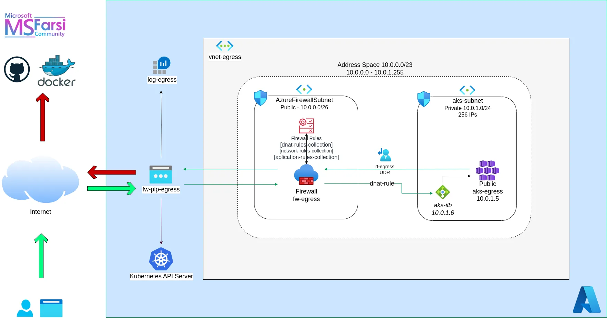

# MSFasri 2024 Scholarship - Group #4

## Contents

### Solution Architecture

### Scenario

_**Azure Docker and Kubernetes Scenario**_

Scenario Overview: A company, TechStream Solutions, is modernizing its application infrastructure by containerizing its applications and deploying them using Azure Kubernetes Service (AKS). The company aims to leverage the scalability and flexibility of Kubernetes, while ensuring that all outbound traffic from the application environment is securely controlled using Azure Firewall.

As an Azure Administrator, your task is to design and demonstrate a containerized application deployment using Azure Docker and AKS, while ensuring that outbound traffic is routed through Azure Firewall for secure and controlled communication.

**Goals:**

- Deploy a Containerized Application: Demonstrate the deployment of a containerized application using Azure Docker and AKS.
- Control Outbound Traffic with Azure Firewall: Set up Azure Firewall to control and monitor all outbound traffic from the Kubernetes environment, ensuring that only approved destinations are accessible.
- Network Security and Traffic Control: Ensure that the application environment follows best practices for network security, restricting unauthorized outbound traffic while allowing necessary communication for the application’s functionality.

**Student Notes:**

- Containerization and Kubernetes Deployment: You will need to containerize the application and deploy it using AKS.
- Azure Firewall Integration: Configure Azure Firewall to manage and control all outbound traffic from the Kubernetes cluster. Ensure that all outgoing connections must pass through the firewall for inspection, and configure rules that restrict or allow traffic based on the company’s security policy.
- Traffic Filtering: Design firewall rules to ensure that only specific, necessary endpoints are reachable from the AKS environment. Demonstrate how unauthorized outbound traffic is blocked, and how allowed traffic is monitored and logged.
- Network Security: Make sure to consider least-privilege access and network segmentation.

**Important Considerations:**

- Container Orchestration: Students should understand the process of creating and managing Docker containers and deploying them within Azure Kubernetes Service.
- Outbound Traffic Security: Pay particular attention to controlling outbound traffic from the AKS cluster. All traffic must be routed through Azure Firewall, and only authorized endpoints should be accessible.
- Logging and Monitoring: Ensure that Azure Firewall logs all outgoing traffic for auditing and monitoring purposes. Set up monitoring tools to track outbound connections and identify any suspicious or unauthorized attempts.
- Cost Optimization: Consider the cost implications of deploying a scalable Kubernetes cluster and using Azure Firewall to manage traffic. Ensure that the solution is both cost-effective and meets security requirements.

**Expectations:**

- Containerization and AKS Deployment: Students should demonstrate how to create Docker containers for an application and deploy them within an Azure Kubernetes Service cluster. The deployment should ensure scalability and flexibility.
- Azure Firewall Setup: Configure Azure Firewall to control outbound traffic from the AKS environment. Students should show how to set up rules that allow or block specific traffic, ensuring compliance with the company’s security policy.
- Traffic Control Demonstration: Demonstrate that all outbound traffic is routed through Azure Firewall. Show how unauthorized traffic is blocked, and explain how the rules were configured to meet the application’s requirements.
